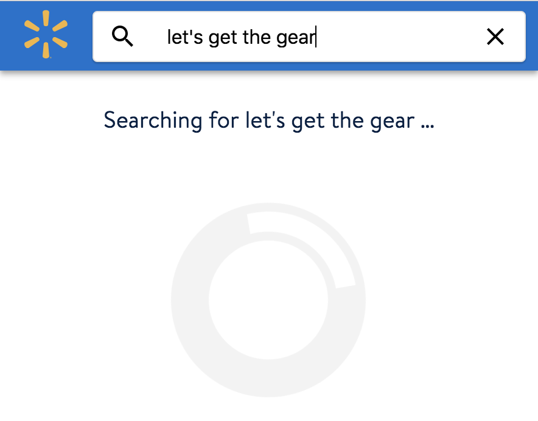
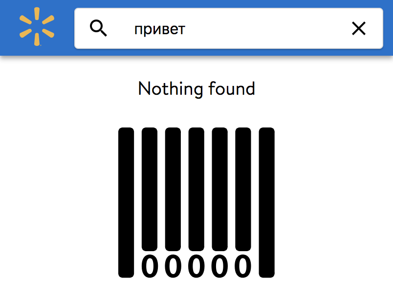
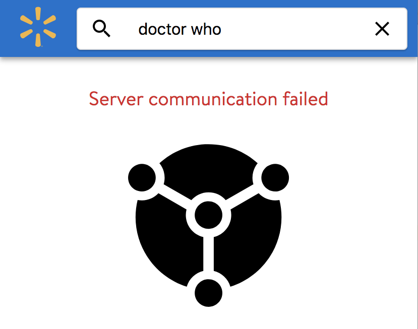
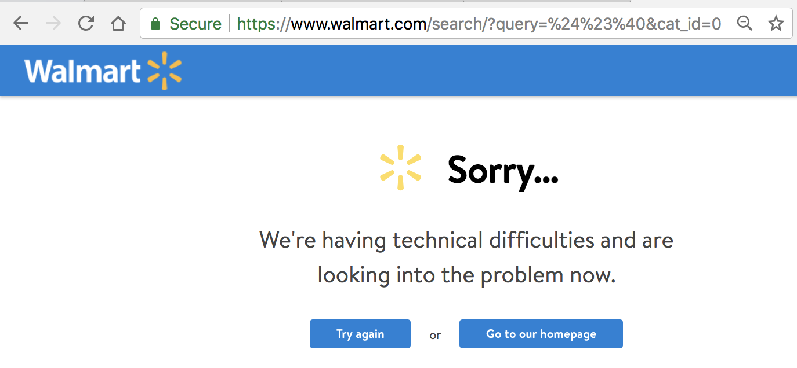
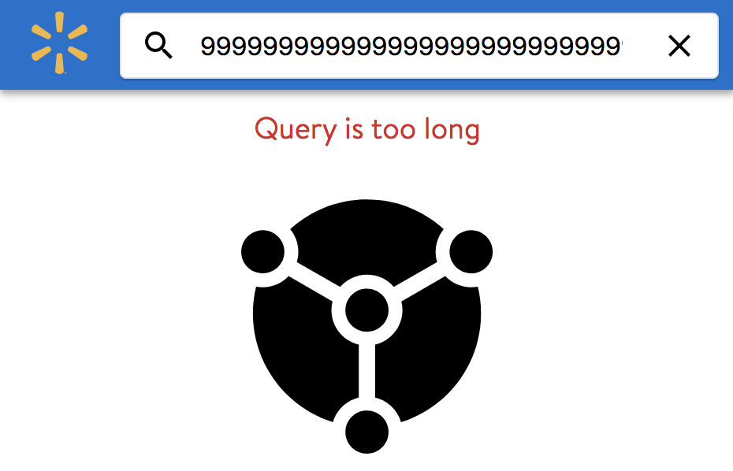

# Walmart Products

Single-page responsive web application to display Walmart product search results and rank-ordered recommendations.

## Live Demo

[http://rockvillesoft.com/walmart](http://rockvillesoft.com/walmart)

## Build

### 1. Build client in /client
```
    npm install
    npm run-script build
```
result -> /client/dist/index.html, main.css, main.js and fonts folder

###  2. Builder server in /server
```
    gradle bundle
```
during server build all client artifacts bundled into produced java web archive
result  -> /server/build/libs/walmart-1.0.war

###  3. Run 
```
    export WL_API_KEY=[your WalmartLabs API key]
    java -jar walmart-1.0.war     
```
open browser [http://localhost:8080](http://localhost:8080) 

  
All 3 steps could be executed through:
```
    ./build.sh
    ./run.sh
```

### Data Loading

Search API returns all product information including long description. API do not provide option to reduce 'list' data to absolute minimum. 
So there is no need of fetching product details in a loop (which was prescribed by requirement).  

Recommendation API return data without wrapper, which makes working with it more complicated: difference between error and positive response by structure (object vs array)

Server app function as a proxy   

### Caching

* search result : 1 minute
* trends : 10 minutes
* product details : 5 minutes
* product details cached with associated recommendations (when product loaded by ID this approach will give 2x boost on reducing number of API calls. but when product information is already loaded during search and trends operations this gives up to 10% traffic overhead, not paying attention to gzip filter). this obviously cold be done differently.   


### URL and bookmarks

All states in the app reflected by URL (bookmarks and direct links)

* search query with single term:
    * [algorithms](http://rockvillesoft.com/walmart/#/search/algorithms) 
* search with sentence:     
    * [fake news](http://rockvillesoft.com/walmart/#/search/fake+news)
    * [friends season #1](http://rockvillesoft.com/walmart/#/search/friends+season+%231)
* search of sepcial characters:    
    * [ © ](http://rockvillesoft.com/walmart/#/search/+©+)
    * [Wall-E](http://rockvillesoft.com/walmart/#/search/Wall-E)
* empty search such as `$#@`, `+` or empty string as search criteria produce result of current product trends
    * [$#@](http://rockvillesoft.com/walmart/#/search/$%23@)
    * [doctor who ? ~!@#$percent^&*()_+/.,<>?;':"[]\|}{](http://rockvillesoft.com/walmart/#/search/doctor%20who%20%3F%20~!%40%23%24percent^%26*()_%2B%2F.%2C<>%3F%3B'%3A"[]\|}{)
    * known issues with `%` character      
* search history
    * perform search 3 times:
        * [doctor who 1](http://localhost:9000/#/search/doctor+who+1)
        * [doctor who 2](http://localhost:9000/#/search/doctor+who+2)
        * [doctor who 2](http://localhost:9000/#/search/doctor+who+3)
    * go back 2 times:
        * search results should be reverted
        * query string should reflected in URL


### Loading corner cases

* Initial Loading



* Load completed successfully but without any information (empty response)




* Communication Issues
    * Backend server (or cluster is down: in the non DEMO case suppose to be repeat-N logic instead of error)
    * Load balancer failures
    * Network issues



* Server API Issues (not applicable in current implementation)
    * Incorrect client implementation (applicable only during development or migrations)
    * Client (or 3d party system) passes wrong arguments or violate API protocol. While thinking on examples of incorrect API requests I found this one: `$#@` which broke ___walmart.com___
       


it should be handled properly, so user (or system) will be capable to continue

Here is example behavior in case when HTML input element has no length limitation:



* Reload Data
    
In this application it is possible to click on `recommendation` and navigate to another product

### UI / UX
* corner cases for search query are defined in requirements so empty search string return trends
* products has different title length which leads to different number of title lines (1-2-3 and even 4). Current implementation renders product in a grid and price tag 'jumps' up and down across a line. This obviously could be fixed with table approach. 
* product grid cell and product recommendations swipe view uses the same UI component 'Product' with predicted behaviour
* no images upscale
* quick navigation from search results and from recommendation to product details : reduce user wait time and avoid blinks
* reload search on back button has no UI cache (on purpose) -> new products could appear / disappear for specified search criteria or trends  
* out of scope
    * Localization and text/ui orientation
    * Accessibility: label areas,
 
## Incomplete (TODO)
*  REST API testing:
    * for each endpoint verify and corners cases (incorrect input, timeouts)
    * for non API requests server should always respond with propper error and http status codes
* UI end to end tests
    * webpack / webdriver.io / selenium         
* Classes and methods comments
* Change js/scss structure. Organize components in folders by components name
* JS : apply jslint
* JS : cleanup / simplify code

       


    
    
